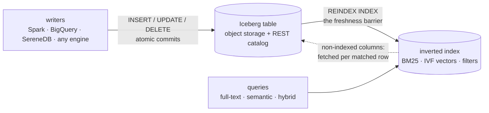

import SqlLogicTest from "@site/src/components/SqlLogicTest";

# Search over Iceberg: insert → searchable

An Iceberg table in your own object storage is the source of truth; SereneDB keeps a derived search index over it. Any engine — Spark, BigQuery, Flink, SereneDB itself — writes rows to the table; one `REINDEX` makes everything committed before it searchable, atomically. Full-text (BM25), vector similarity and hybrid queries then run against the index in one SQL statement.

What lives where:

- **The Iceberg table** (your bucket, your catalog) holds the rows — text, metadata, embeddings — as plain Parquet. It stays fully yours: every engine can read and write it, and `REINDEX` picks up foreign commits, updates and deletes the same way.
- **SereneDB** holds only the derived index (term dictionaries, vector structures, indexed columns) on local disk. There is no second copy of the corpus — lose the node, rebuild the index from the table. Columns you did not index are still selectable: they are materialized from the source Parquet at query time, only for the rows a query matched.

## How REINDEX refreshes

`REINDEX INDEX <name>` runs one pass: it compares the current source state against what the index holds, applies the difference, and publishes atomically — readers see the previous complete state or the new one, never a partial index. Iceberg tables and file globs refresh **incrementally** (only the difference is indexed); other sources rebuild in full — the [per-source table in the reference](../../sql/indexes/inverted/views.md#refreshing-the-index) has the details.

The rest of this page builds both delta roads from zero — first the Iceberg pipeline, then the same lifecycle over a plain directory of files.

## Connect the object store

The warehouse data lives in object storage; give SereneDB credentials for it. A `PERSISTENT SECRET` survives restarts:

<SqlLogicTest id="cookbook/search/insert_to_searchable_iceberg/example_secret" />

## Attach the catalog

`CREATE SERVER` attaches the Iceberg REST catalog as a database. The server row persists in the SereneDB catalog and re-attaches at boot, so everything built on it survives restarts unattended. `max_table_staleness` bounds how old a cached table version may be served between refreshes:

<SqlLogicTest id="cookbook/search/insert_to_searchable_iceberg/example_server" />

## Create the table

Skip this if the table already exists — the point of the pattern is that any engine may own it. Created from SereneDB it is a regular Iceberg table like any other:

<SqlLogicTest id="cookbook/search/insert_to_searchable_iceberg/example_table" />

## Index it

Expose the table through a view (casting the embedding list to a fixed-size vector), then index the view: filter columns as plain terms, the text column through an analyzer for BM25, the vector column with IVF for similarity search. See [Indexes over views](../../sql/indexes/inverted/views.md) for everything the index can do:

<SqlLogicTest id="cookbook/search/insert_to_searchable_iceberg/example_index" />

## The freshness barrier

Writers commit batches to the table; `REINDEX INDEX` runs one pass and returns only when everything committed before it is searchable. That makes freshness a one-statement barrier in any pipeline — load the data, run `REINDEX`, start the consumers:

<SqlLogicTest id="cookbook/search/insert_to_searchable_iceberg/example_barrier" />

Everything from the batch is now in the index:

<SqlLogicTest id="cookbook/search/insert_to_searchable_iceberg/example_barrier_check" />

## New data keeps arriving

Each commit adds Parquet files to the table; the next pass indexes **only those** — the three rows already indexed above are not re-read:

<SqlLogicTest id="cookbook/search/insert_to_searchable_iceberg/example_add" />

<SqlLogicTest id="cookbook/search/insert_to_searchable_iceberg/example_add_check" />

To run the pass on a schedule instead of by hand, set the [`reindex_interval`](../../sql/indexes/inverted/views.md#automatic-refresh) index option — the loop survives server restarts.

## Query

Vector similarity, scoped to a filter — everything below answers from the index:

<SqlLogicTest id="cookbook/search/insert_to_searchable_iceberg/example_semantic" />

Hybrid — full-text filter plus semantic ranking in one statement:

<SqlLogicTest id="cookbook/search/insert_to_searchable_iceberg/example_hybrid" />

Selecting a column the index does not hold (`uri` here) still works: it is fetched from the source Parquet at query time, only for the matched rows:

<SqlLogicTest id="cookbook/search/insert_to_searchable_iceberg/example_materialize" />

## Updates

Rewrite rows in the table — from SereneDB or any other engine — and the next pass reindexes just the affected files:

<SqlLogicTest id="cookbook/search/insert_to_searchable_iceberg/example_update" />

The search sees the new text, not the old:

<SqlLogicTest id="cookbook/search/insert_to_searchable_iceberg/example_update_check" />

## Deletes

Deletes are the same story. Drop one document:

<SqlLogicTest id="cookbook/search/insert_to_searchable_iceberg/example_delete" />

Its rows are gone; everything else never left the index:

<SqlLogicTest id="cookbook/search/insert_to_searchable_iceberg/example_delete_check" />

## The same over plain files

No catalog at all — a directory of Parquet (or CSV, JSON) files behaves the same way, locally or on S3. Index a view over a glob:

<SqlLogicTest id="cookbook/search/insert_to_searchable_iceberg/example_glob_setup" />

A new file lands in the directory — the pass picks up **just that file**:

<SqlLogicTest id="cookbook/search/insert_to_searchable_iceberg/example_glob_add" />

<SqlLogicTest id="cookbook/search/insert_to_searchable_iceberg/example_glob_add_check" />

A file disappears — the next pass drops its rows:

<SqlLogicTest id="cookbook/search/insert_to_searchable_iceberg/example_glob_remove" />

<SqlLogicTest id="cookbook/search/insert_to_searchable_iceberg/example_glob_remove_reindex" />

<SqlLogicTest id="cookbook/search/insert_to_searchable_iceberg/example_glob_remove_check" />
