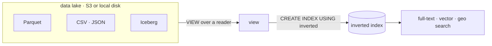

import SqlLogicTest from "@site/src/components/SqlLogicTest";
import DocCallout from "@site/src/components/DocCallout";

**Search your data lake in place — no ETL.** An [inverted index](./index.md) can be built directly over **external files** — Parquet, CSV, JSON, ORC and Iceberg, on local disk or S3 — so you get full-text, [vector](./vector-search.md) and [geospatial](./geospatial-search.md) search over data that **never gets copied into the database**. You point a [view](./views.md) at a reader function and index the view; the rows stay in the files, and only the search postings are built.



This is **zero-ETL search**: no pipeline to move data into a search engine, no second copy to keep in sync, no separate cluster. The files remain the source of truth; the index is a searchable view over them. It is ideal for log and event lakes, document and embedding archives, and any large Parquet/Iceberg dataset you want to search without an ingest step.

The same applies to data that lives in another **database** rather than in files: a table in an attached PostgreSQL or ClickHouse instance can be indexed the same way — see [External databases](#external-databases).

## Supported sources

| Source | Reader | Notes |
|---|---|---|
| Parquet | `read_parquet` / `parquet_scan` | Single file or glob; `file_row_number` PK |
| CSV | `read_csv` / `read_csv_auto` | Byte-offset PK; full reader-option support |
| JSON / NDJSON | `read_json` / `read_ndjson` (`*_auto`) | Byte-offset PK |
| Iceberg | `iceberg_scan(...)` / catalog table | Snapshot at build time |
| Attached DuckDB | `ATTACH … ; SELECT … FROM db.schema.t` | Read through the live attachment |
| Attached PostgreSQL | `ATTACH` / [`CREATE SERVER`](../../statements/create_server/index.md) | Keyed on the remote `ctid`; see [External databases](#external-databases) |
| Attached ClickHouse | `ATTACH` / [`CREATE SERVER`](../../statements/create_server/index.md) | Keyed on the engine's primary key; see [External databases](#external-databases) |
| Text / blobs | `read_text` / `read_blob` | One document per file (or per glob entry) |

Local paths and `s3://` URLs (via httpfs) both work, as do **globs** (`'…/*.parquet'`) spanning thousands of files across a partitioned dataset.

## How it works

Define a view over the reader, then create the index on the view. The reader's row identity (`file_row_number`, byte offset or a `(file_index, position)` pair for globs) is detected automatically — no `WITH (pk = ...)` needed:

<SqlLogicTest id="cookbook/search/indexing-external-data/example_001" />

Attach a [text search dictionary](./text-analysis.md) to the text columns and build the index. Columns without a dictionary are indexed verbatim:

<SqlLogicTest id="cookbook/search/indexing-external-data/example_003" />

<SqlLogicTest id="cookbook/search/indexing-external-data/example_004" />

Then query the index by name, exactly like any other inverted index:

<SqlLogicTest id="cookbook/search/indexing-external-data/example_005" />

Only the columns the index needs are read from the files at build time — projection and predicate pruning are pushed into the reader, so indexing a wide Parquet dataset touches just the indexed columns. See the [Indexing External Data](../../../cookbook/search/indexing-external-data.md) cookbook recipe for an end-to-end walkthrough, and [Indexing Views](./views.md) for the underlying fast-path, row-identity and materialization rules.

## External databases

The source does not have to be a file. An inverted index can be built over a table in an **attached PostgreSQL or ClickHouse database** — reached with [`ATTACH`](../../statements/attach/index.md) for the current session, or with a persistent [`CREATE SERVER`](../../statements/create_server/index.md). Point a view at the remote table and index the view: the postings are built and stored in SereneDB, while the rows stay in the remote engine.

```sql
CREATE SERVER analytics FOREIGN DATA WRAPPER clickhouse_fdw
  OPTIONS (host 'clickhouse.internal', port '9000', database 'events');

CREATE VIEW pageviews_v AS
  SELECT id, body, views FROM analytics.events.pageviews;

-- `en` is a text search dictionary; see Text Analysis.
CREATE INDEX pageviews_idx ON pageviews_v USING inverted(body en);
```

Matched rows are re-read from the remote **by value**: the index yields the key of each match, and SereneDB issues one lookup query per batch which the connector pushes down as a remote `WHERE`. That is the only way a remote row can be re-found, so what the key *is* matters.

### The default key

| Source | Key used | Why |
|---|---|---|
| Attached PostgreSQL table | The row's `ctid` | Universal — no `PRIMARY KEY` required — and unique within the index snapshot. The lookup is pushed down as `ctid IN (…)`, a TID scan. |
| Attached ClickHouse table | The table's primary-key columns, in order | Part-and-offset row ids do not survive merges. The whole `ORDER BY` / `PRIMARY KEY` tuple is used, at whatever arity and column types it has — composite keys are the norm in ClickHouse. |

<DocCallout type="attention">

A ClickHouse table with **no primary-key metadata** is not a fast-path source: there is no key to re-fetch by. The index still builds and `COUNT(*)`, `@@` filters and [BM25](./ranking.md) scores still come off it, but selecting a real non-indexed column raises the "not yet supported" [materialization error](./views.md#generic-views). The same applies to a view over a connector *query function* (`clickhouse_query(…)`, `postgres_query(…)`) — a query result carries no table metadata. Use [`INCLUDE`](./views.md#include-columns) columns in that case.

</DocCallout>

### Overriding the key with `key_columns`

`WITH (key_columns = '…')` names the columns to key on explicitly, taking precedence over the connector default:

```sql
CREATE VIEW shards_v AS SELECT shard, id, body, views FROM analytics.default.shards;

CREATE INDEX shards_idx ON shards_v
  USING inverted(body en)
  WITH (key_columns = 'shard, id');
```

- The value is a **comma-separated list of column names** of the source table (surrounding whitespace is ignored).
- Any arity and any column types work. The key columns are stored together as a single struct column of their own types, so nothing has to be a 64-bit integer — a `(VARCHAR, BIGINT)` key is as valid as a single `UInt8`.
- A single key column re-fetches with `WHERE key IN (…)`; several with `(a = … AND b = …) OR …`.

Reach for it when the ClickHouse table has no primary-key metadata to fall back on, or when the engine key is not the key you want to re-fetch by.

<DocCallout type="attention">

A ClickHouse primary key is a **sorting prefix, not a uniqueness constraint**. Rows sharing a key each index their own document, and materializing a match returns *every* row that shares that key. If you need one row per match, give `key_columns` a genuinely unique key.

Naming a column that does not exist on the source table does not fail the `CREATE INDEX` — it leaves the index with no usable key, so materialization then raises the not-supported error. Check the column names.

</DocCallout>

`key_columns` only affects attached PostgreSQL and ClickHouse tables. It is accepted on other source kinds but has no effect there, since their row identity is always derived automatically (see [Row identity](./views.md#row-identity)).

## Reader parameters

Reader options are preserved: the same parameters used to build the index are replayed when columns are [materialized](./views.md#materializing-real-columns). CSV options (`delim`, `header`, `quote`, `nullstr`, `skip`, `compression`, `columns`, `types`, `dateformat`, …), JSON options (`format`, `records`, `columns`, `maximum_object_size`, …) and Parquet options (`binary_as_string`, `hive_partitioning`, `file_row_number`, …) all round-trip.

<DocCallout type="attention">

A few combinations are rejected at materialization time and fall back to the standard "fast-path not supported" error — most notably **gzip-compressed JSON** (positional re-reads aren't possible on a gzip stream). Unknown reader arguments fail when the view is created.

</DocCallout>

## Freshness

An external-data index is a **static snapshot** of the postings at `CREATE INDEX` time; it does not track changes to the files. When the underlying data changes, rebuild the index:

<SqlLogicTest id="cookbook/search/indexing-external-data/example_006" />

<DocCallout type="tip">

Incremental refresh of external-data indexes — picking up new and changed files without a full rebuild — is on the roadmap. For now, rebuild to pick up changes.

</DocCallout>

Materialized column *values* are read live from the current files, so counts and scores reflect the build-time snapshot while a materialized column reflects the file as it is now (a row removed from the source materializes as `NULL`).

The same split applies to an [external database](#external-databases), with one difference: rows are re-fetched **by key**, so a row deleted on the remote since the index was built does not come back as `NULL` — it is simply absent from the result. A query that materializes columns can therefore return fewer rows than a `COUNT(*)` off the same index, or more if several remote rows share one key (see the note on ClickHouse keys above).

## See also

- [Indexing Views](./views.md) — row identity, fast paths, materialization
- [`CREATE SERVER`](../../statements/create_server/index.md) — persistent foreign servers over PostgreSQL and ClickHouse
- [Inverted Index](./index.md) · [Full-Text Search](./full-text-search.md) · [Vector Search](./vector-search.md) · [Geospatial Search](./geospatial-search.md)
- [Indexing External Data recipe](../../../cookbook/search/indexing-external-data.md)
