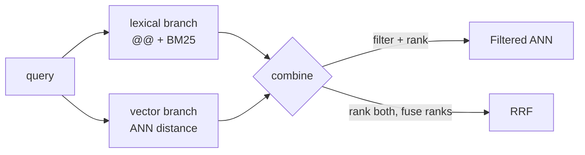

import SqlLogicTest from "@site/src/components/SqlLogicTest";

**Hybrid search** combines a lexical signal (full-text [`@@`](./full-text-search.md) matching, ranked by [BM25](./ranking.md)) with a [vector](./vector-search.md) signal (ANN distance). Because a single [inverted index](./index.md) can cover both a text column and a vector column, the two can be combined in one query. There are two common strategies.

The examples use a `catalog` table indexed on a text column (`name`), a verbatim column (`category`) and a vector column (`emb`) in one inverted index.

## Filtered ANN

When one signal is a hard filter and the other ranks, put the filter in `WHERE` and the vector distance in `ORDER BY`. This restricts the candidate set, then ranks the survivors by similarity. The filter can be a full-text predicate:

<SqlLogicTest id="sql/indexes/inverted/hybrid-search/example_001" />

…or a structured / verbatim predicate:

<SqlLogicTest id="sql/indexes/inverted/hybrid-search/example_002" />

Filtered ANN is the right choice when the filter is meaningful (a category, a permission, a required keyword) and you only want similarity to order the matches.

## Score fusion

When both signals should *rank* results — neither is a strict filter — fuse two independently-ranked result lists. How you fuse depends on whether the scores are comparable:

- **Weighted sum** (`α·s₁ + β·s₂`) works when the scores share a scale. Lexical and vector scores usually do **not**: a BM25 magnitude and a cosine/L2 distance live on different scales, so a raw weighted sum is dominated by whichever scale is larger.
- **Reciprocal Rank Fusion (RRF)** sidesteps the scale problem by combining *ranks* instead of scores: each document's contribution is `1 / (k + rank)` summed across branches. This is the standard choice for lexical + vector fusion.

The query below runs a BM25 branch and a vector branch, ranks each independently and fuses them with RRF. The vector distance is ascending (nearer is better), so its branch orders by `dist`; the BM25 branch orders by score descending:

<SqlLogicTest id="sql/indexes/inverted/hybrid-search/example_003" />

Each branch caps its contribution with a per-branch `LIMIT` (the window size), assigns ranks with `ROW_NUMBER()` and the outer query sums `1 / (k + rank)` per id. See [Reciprocal Rank Fusion](../../../cookbook/search/reciprocal-rank-fusion.md) for the full treatment of `k`, window size and tuning.

## See also

- [Vector Search](./vector-search.md) · [Full-Text Search](./full-text-search.md)
- [Reciprocal Rank Fusion](../../../cookbook/search/reciprocal-rank-fusion.md) — RRF theory and tuning
- [BM25/TFIDF Ranking](../../../cookbook/search/ranking.md)
