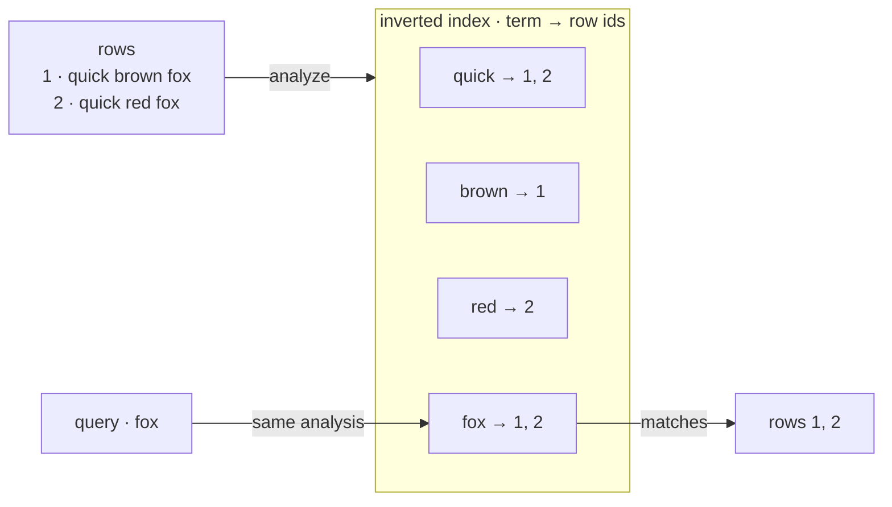
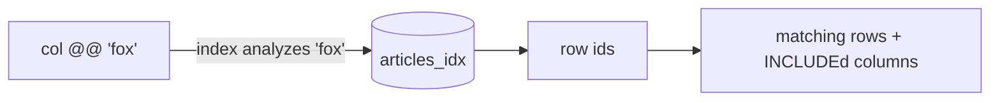

import SqlLogicTest from "@site/src/components/SqlLogicTest";
import DocCallout from "@site/src/components/DocCallout";

An **inverted index** maps each token back to the rows that contain it. Instead of scanning every row, the engine looks up the query's tokens and jumps straight to the matching rows — which is what makes full-text search fast. SereneDB's inverted index is built on [IResearch](https://github.com/serenedb/serenedb/tree/main/libs/iresearch) and, beyond text, the same index also powers [vector / approximate-nearest-neighbor search](./vector-search.md) and [geospatial search](./geospatial-search.md).



The guiding principle is that **the same analysis is applied at index time and at query time** (see [Text Analysis](./text-analysis.md)). The [text search dictionary](./text-analysis.md) attached to a column decides how its text is split into tokens and normalized; that identical pipeline runs on the query, so the search terms always match the stored tokens even when the surface forms differ.

## Choosing a search type

One inverted index can serve several kinds of search, each documented on its own page:

| You want to… | Use | Page |
|---|---|---|
| Match natural-language text, rank by relevance | Full-text search (`@@`, BM25) | [Full-Text Search](./full-text-search.md) · [Ranking](./ranking.md) |
| Find nearest vectors / semantic similarity | Vector / ANN search (IVF) | [Vector Search](./vector-search.md) |
| Combine a lexical signal with a vector signal | Hybrid search | [Hybrid Search](./hybrid-search.md) |
| Query points, shapes and distances | Geospatial search (`ST_*`) | [Geospatial Search](./geospatial-search.md) |
| Match exact values, ids, tags, enums | Verbatim columns + range predicates | [Full-Text Search](./full-text-search.md#range-queries) |

## Creating an inverted index

An inverted index is created by adding `USING inverted` to [`CREATE INDEX`](../../statements/create_index/inverted.md). The example below indexes two text columns with a dictionary, then queries the index by name:

<SqlLogicTest id="sql/indexes/inverted/index/example_001" />

This page covers the concepts. For the complete `CREATE INDEX … USING inverted` grammar — every operator-class option, `INCLUDE` codec, index `WITH` option and supported column type — see the [statement reference](../../statements/create_index/inverted.md).

A trailing `WHERE <predicate>` builds a [partial index](../../statements/create_index/inverted.md#partial-indexes) that contains only the matching rows; DML keeps membership current as rows cross the predicate boundary.

<DocCallout type="tip">

After loading data, run `VACUUM (REFRESH_TABLE) table_name` to make newly inserted rows visible to the index immediately. A background thread otherwise refreshes the index on an interval — see [Maintenance](./maintenance.md).

</DocCallout>

## Operator classes and fields

Each indexed column carries its **own operator class** — the `column [dictionary] [WITH (...)]` form in the column list tells the index how to analyze and store *that* column. Different columns in the same index can use different operator classes:

- a column with a **dictionary** is analyzed into tokens (full-text);
- a column with **no dictionary** is indexed verbatim — one token per value — giving exact, case-sensitive matching, ideal for ids, tags and enum-like categories;
- a numeric or temporal column is indexed for [exact and range queries](./full-text-search.md#range-queries);
- a `FLOAT[N]` column with `ivf (...)` is indexed for [vector search](./vector-search.md), and a `JSON`/`GEOMETRY` column with a geo dictionary for [geospatial search](./geospatial-search.md).

The example below puts an analyzed column (`name`) and a verbatim column (`category`) in one index:

<SqlLogicTest id="sql/indexes/inverted/index/example_003" />

Because operator classes are per-column, a single index can mix full-text, verbatim and numeric (and vector and geo) columns, and a query can constrain several of them at once:

<SqlLogicTest id="sql/indexes/inverted/index/example_006" />

<DocCallout type="tip">

**Field order does not matter.** This is a key difference from a regular composite (ART) index, where column order is significant and only a query constraining a *leading prefix* of the columns can use the index. An inverted index indexes each field independently: the order of fields in `USING inverted (...)` carries no meaning, and a query may constrain **any subset of the indexed fields, in any combination**, and still be served entirely by the index.

</DocCallout>

<DocCallout type="tip">

**Analyzed vs. verbatim.** A column *with* a dictionary is tokenized and normalized, so `'Running Shoes'` matches `shoes`. A column *without* a dictionary stores the value verbatim, so it only matches the exact string. Choose verbatim for identifiers, codes and categories; choose a dictionary for natural-language text. See [Text Analysis](./text-analysis.md).

</DocCallout>

## Querying an inverted index

An inverted index behaves as a **queryable relation**: full-text, verbatim, range and geospatial predicates are issued by selecting **from the index by name**, with the [`@@` match operator](./full-text-search.md) on the indexed column.



```sql
SELECT id, title
FROM articles_idx          -- the index, by name
WHERE body @@ 'search';    -- @@ match on an indexed column
```

A `TSQUERY` predicate (`@@`, `ST_*`, range functions) only resolves **against an inverted-indexed column inside the index relation** — issuing it against the base table raises an error. The exception is [vector ANN](./vector-search.md): an `ORDER BY emb <-> $q LIMIT k` is routed through the IVF index automatically whether you select from the index or the base table.

<DocCallout type="tip">

**Filtering vs. ranking.** `WHERE col @@ query` is a yes/no filter (does the row match?). Relevance is separate: order matches with a scorer such as `ORDER BY BM25(idx.tableoid) DESC` — see [Ranking](./ranking.md).

</DocCallout>

## Indexed vs. `INCLUDE`d columns

Columns in the `USING inverted (...)` list are **indexed** — searchable with `@@`. Columns in the `INCLUDE (...)` list are **stored but not indexed**: they cannot be searched, but they can be returned by a query against the index, avoiding a separate lookup against the base table.

<SqlLogicTest id="sql/indexes/inverted/index/example_002" />

See [What to Index](./modeling.md) for choosing indexed vs. `INCLUDE`d columns, indexing expressions and JSON, and sizing trade-offs.

## Indexing a table or a view

An inverted index can be built over a base **table** or a **view**:

- **Base tables** use the table's `PRIMARY KEY` as row identity, and the background refresh tracks inserts, updates and deletes.
- **Views** let you index data the database does not own a primary copy of — including [external Parquet/CSV/JSON files](./external-data.md) on disk or S3. A view-backed index is a static snapshot.

<SqlLogicTest id="sql/indexes/inverted/index/example_005" />

See [Indexing Views](./views.md) and [Indexing External Data](./external-data.md).

## Lifecycle

An inverted index is **eventually consistent**: after a write, the new rows become searchable once the index is refreshed — immediately with `VACUUM (REFRESH_TABLE)`, or automatically by the background refresh thread. Compaction merges segments in the background. See [Maintenance & Introspection](./maintenance.md) for the full refresh / compaction / statistics model and how to inspect an index.

## Limitations

- Indexed expressions cannot contain aggregates, subqueries or volatile functions (e.g. `random()`).
- `HUGEINT`, `DECIMAL`, `UUID` and `INTERVAL` columns cannot be indexed.
- Composite `ROW(...)` columns are not supported.
- The same indexed expression cannot be listed twice with different dictionaries.

## See also

- [Text Analysis](./text-analysis.md) · [What to Index](./modeling.md)
- [Full-Text Search](./full-text-search.md) · [Ranking](./ranking.md) · [Vector Search](./vector-search.md) · [Hybrid Search](./hybrid-search.md) · [Geospatial Search](./geospatial-search.md)
- [Indexing Views](./views.md) · [Indexing External Data](./external-data.md) · [Maintenance & Introspection](./maintenance.md)
- [`CREATE INDEX … USING inverted`](../../statements/create_index/inverted.md) — full syntax reference
- [Migrating from Elasticsearch](./migrating-from-elasticsearch.md) · [Search cookbook](../../../cookbook/search/index.md)
