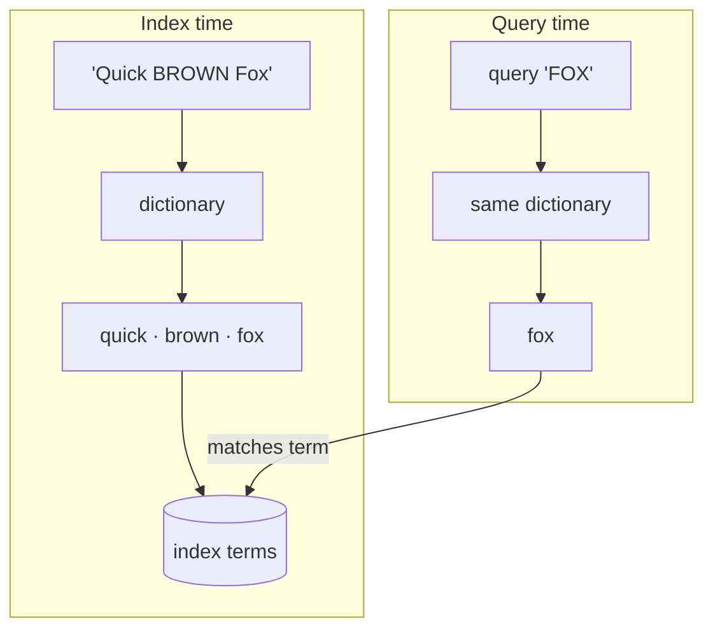
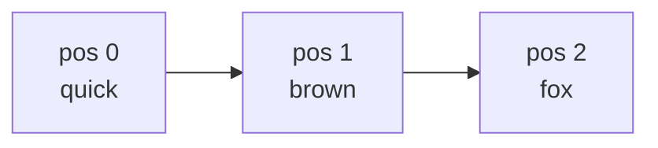

import SqlLogicTest from "@site/src/components/SqlLogicTest";
import DocCallout from "@site/src/components/DocCallout";

**Text analysis** turns the free-form text of a column into the sequence of **tokens** that an [inverted index](./index.md) actually stores and searches. Getting analysis right is what lets a search for `running shoes` find a document that says `Run faster in our Shoes!` — the surface forms differ, but they analyze to the same tokens.

Analysis in SereneDB is configured entirely through a [**text search dictionary**](../../statements/create_text_search_dictionary/index.md) attached to a column. A dictionary is assembled from **templates**: some templates *tokenize* (split text into tokens), others *normalize* (lowercase, fold accents, stem, drop stop words), and the `pipeline` template *composes* them. There is no separate "token filter" object — every stage is a template.

<DocCallout type="tip">

**Token vs. term.** A *token* is produced during analysis and carries metadata (its position, character offsets). A *term* is the normalized value that actually lands in the index. Tokens are what the pipeline transforms; terms are what you match against.

</DocCallout>

## The same analysis at index time and query time

The single most important rule: **a column's dictionary is applied both when the column is indexed and when a query runs against it.** The data and the query pass through the identical pipeline, so their tokens line up.

Without analysis, a literal comparison of the query `FOX` against the stored text `Quick BROWN Fox` would not match. After analysis both sides reduce to the token `fox`, and the lookup succeeds. You can preview exactly how a dictionary tokenizes any string with [`ts_lexize`](../../functions/search/full-text.md#utility-functions) — use it whenever you are tuning a dictionary:

<SqlLogicTest id="sql/indexes/inverted/text-analysis/example_001" />

:::tip Overriding the query-time analyzer

Symmetry is the default, not a hard rule. To analyze a query string with a *different* dictionary than the column's — Elasticsearch's [`search_analyzer`](https://www.elastic.co/guide/en/elasticsearch/reference/current/specify-analyzer.html) — wrap it in [`ts_tokenize(text, 'dict')`](../../functions/search/full-text.md#ts_tokenize) or the `'text'::tokenize('dict')` cast. A common use is forcing exact matching against an otherwise-stemmed column with `'…'::tokenize('keyword')`.

:::

## Tokenizing templates

The tokenizing template decides how text is split. The most common is `text`, which splits on word boundaries (shown above). Others target specific needs:

A **verbatim** column — the `keyword` template, or simply a column with *no* dictionary — emits the whole value as a single token, giving exact, case-sensitive matching for ids, codes and categories:

<SqlLogicTest id="sql/indexes/inverted/text-analysis/example_002" />

The `ngram` template emits overlapping character n-grams, which power substring and fuzzy matching:

<SqlLogicTest id="sql/indexes/inverted/text-analysis/example_003" />

Further tokenizing templates — `sparse_ngram`, `delimiter` / `multi_delimiter`, `segmentation`, `pattern`, `path_hierarchy`, `wildcard` — are listed in the [`CREATE TEXT SEARCH DICTIONARY` reference](../../statements/create_text_search_dictionary/index.md).

## Normalization

Normalization rewrites tokens so that equivalent forms collapse together. The `text` template exposes the common normalizers as options:

**Stemming** reduces words to a root form, improving recall by matching different inflections:

<SqlLogicTest id="sql/indexes/inverted/text-analysis/example_004" />

**Stop words** drop high-frequency words that carry little meaning (the list is comma-separated and quoted):

<SqlLogicTest id="sql/indexes/inverted/text-analysis/example_005" />

**Accent folding** maps accented characters to their ASCII base so `café` matches `cafe`. It is controlled by `accent` — `accent = false` folds accents away, `accent = true` preserves them:

<SqlLogicTest id="sql/indexes/inverted/text-analysis/example_006" />

Case folding (`case = 'lower'`) is applied in every example above. Dedicated normalizing templates also exist — `stem`, `norm`, `stopwords`, [`collation`](../../statements/create_text_search_dictionary/collation.md) — for use inside a pipeline.

**Locale-aware analysis.** The [`collation`](../../statements/create_text_search_dictionary/collation.md) and [`norm`](../../statements/create_text_search_dictionary/norm.md) templates take an ICU `locale`, so sorting and equality follow a language's rules rather than raw byte order — German `de`, for example, sorts `ä` next to `a`. A `collation` dictionary turns each value into one locale-ordered key, which is ideal for [range queries](./full-text-search.md#range-queries) and exact ordering on a column. The same ICU locales back the SQL [`COLLATE` clause](../../expressions/collations/index.md).

## Composing with `pipeline`

The `pipeline` template chains templates in order. Steps are numbered **starting at 1** (`step1_template`, `step2_template`, …). Here a `delimiter` tokenizer splits on commas, then a `norm` step lowercases each token:

<SqlLogicTest id="sql/indexes/inverted/text-analysis/example_007" />

## Token positions and feature flags

By default the index records only which terms appear in which rows. Some query and ranking features need extra per-token information, enabled with **feature flags** on the dictionary (or per-column in the index):

| Flag | Records | Needed for |
|---|---|---|
| `frequency` | how often each term occurs | [relevance scoring](./ranking.md) |
| `position` | each token's ordinal position | [phrase and proximity](./full-text-search.md#phrase-search) queries |
| `offset` | each token's character offsets | [highlighting](./full-text-search.md#highlighting) |
| `norm` | a length-normalization factor | some scorers |

The flags have dependencies: `position` and `norm` require `frequency`, and `offset` requires `frequency` and `position`. Positions are what let phrase search distinguish `quick brown fox` from `fox brown quick` — the tokens are the same, but their positions differ:

Enable only the flags your queries need — each one enlarges the index.

<DocCallout type="tip">

**Analyzed vs. verbatim (term-level).** A column with a dictionary is *analyzed* — matching is token-based and tolerant of form. A verbatim column is *not analyzed* — matching is exact. This mirrors the full-text vs. term-level distinction in other search engines: use analyzed columns for natural language, verbatim columns for exact values.

</DocCallout>

## See also

- [`CREATE TEXT SEARCH DICTIONARY`](../../statements/create_text_search_dictionary/index.md) — every template and option
- [Inverted Index](./index.md) — operator classes and how dictionaries attach to columns
- [Full-Text Search](./full-text-search.md) · [Ranking](./ranking.md)
- [Full-Text Search Functions](../../functions/search/full-text.md) — `ts_lexize` and the query functions
