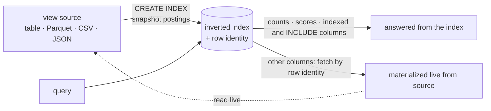

import SqlLogicTest from "@site/src/components/SqlLogicTest";
import DocCallout from "@site/src/components/DocCallout";

An [inverted index](./index.md) can be built over a **view**, not just a base table. This is how SereneDB searches data it does not own a primary copy of — most importantly [external files](./external-data.md) (Parquet, CSV, JSON on disk or S3) exposed through a view.

A view has no primary key of its own, so two things have to be resolved: a **row identity** (so each indexed document can be located again) and, when a query needs a column the index does not hold, a way to **fetch that column on demand**. SereneDB handles both through a *fast-path source*.

Counts, relevance scores and any indexed or `INCLUDE`d column come straight from the frozen index; any *other* column is fetched live from the source by row identity at query time. That split — frozen postings, live values — is the whole model.

<DocCallout type="tip">

A view-backed index stores a **frozen snapshot of the postings** taken at `CREATE INDEX` time — it does not track later changes to the source. Column *values*, however, are read **live** from the source when a query materializes them (see [Materializing real columns](#materializing-real-columns)).

</DocCallout>

All examples below use this setup — a base table and a view over it:

<SqlLogicTest id="sql/indexes/inverted/views/setup" />

## Row identity

How the index derives a stable per-row identity depends on the view body:

| View body | Row identity | Can be overridden |
|---|---|---|
| `SELECT … FROM base_table` (has `PRIMARY KEY`) | The base table's primary key | — |
| `SELECT … FROM base_table` (no PK) | The hidden row id | — |
| `SELECT … FROM read_parquet('file')` | The reader's `file_row_number` | — |
| `read_csv` / `read_json` single file | The byte offset within the file | — |
| Reader over a **glob** (`'…/*.parquet'`) | `(file_index, position)` pair | — |
| Attached DuckDB / Iceberg table | The source row id / `(file_index, row)` | — |
| Attached **PostgreSQL** table | The remote `ctid` | `WITH (key_columns = '…')` |
| Attached **ClickHouse** table | The engine's primary-key columns | `WITH (key_columns = '…')` |
| Generic body (inline `VALUES`, `UNION ALL`, joins) | A synthetic row id | — |

Row identity is always derived automatically — there is no `pk` index option. The only sources that accept an explicit key are [attached external databases](./external-data.md#external-databases), via `key_columns`.

## Fast-path sources

A **fast-path source** is a view body SereneDB recognizes well enough to both derive the row identity and re-read columns by it later. The recognized sources are: SereneDB base tables, `read_parquet` / `read_csv` / `read_json` (and their `*_auto` / `parquet_scan` / `read_ndjson` variants), Iceberg tables, attached DuckDB tables, [attached PostgreSQL and ClickHouse tables](./external-data.md#external-databases) and `read_text` / `read_blob`.

The view body may shape the source freely and still qualify as fast-path:

- a column subset, reordering or renaming (`SELECT body, id FROM …`, `SELECT a AS x FROM …`);
- a cast on the indexed column (`SELECT id::BIGINT, body FROM …`);
- an indexed **expression** over source columns (`upper(body)`, `(json ->> 'b')`);
- a `WHERE` / `ORDER BY` / `LIMIT` in the view body (the index then captures only the rows the view emits).

A body with **no fast-path leaf** — inline `VALUES`, a `UNION ALL`, a join — is a *generic* view: it indexes normally but supports only the non-materializing queries below.

## What runs without materialization

These queries are answered **entirely from the index**, never touching the source — so they work on every view shape, including generic views:

- `COUNT(*)` / `COUNT(1)`, with or without a `@@` filter;
- full-text [`@@` filters](./full-text-search.md) and secondary scalar filters (`=`, `<`, `BETWEEN`, `IN`) that get pushed into the index scan;
- relevance scores — [`BM25`](./ranking.md), `TFIDF` — and the index `tableoid`;
- [`ts_offsets`](./full-text-search.md#highlighting);
- projections of **indexed** columns and of [`INCLUDE`d](#include-columns) columns and aggregates over them.

<SqlLogicTest id="sql/indexes/inverted/views/count_no_materialization" />

<SqlLogicTest id="sql/indexes/inverted/views/score_no_materialization" />

## Materializing real columns

Selecting a real source column that is neither indexed nor `INCLUDE`d **materializes** it: the index hands back the row identities for the matches, and SereneDB re-reads those columns from the source through the fast-path lookup. The column values are **not stored in the index** — they are fetched live at query time:

<SqlLogicTest id="sql/indexes/inverted/views/materialize" />

Because the read is live, if the underlying source changed after the index was built, materialized values reflect the *current* source: rows deleted from the source come back as `NULL`, and edited content shows its new value (or raises an error if a file became unreadable). Counts and scores, by contrast, still reflect the frozen build-time snapshot.

## Generic views

A generic view (no fast-path source) still indexes and answers the non-materializing queries — no extra options are needed, the postings key on a synthetic row id:

<SqlLogicTest id="sql/indexes/inverted/views/generic_pk" />

Selecting its real columns is not supported and raises an error:

<SqlLogicTest id="sql/indexes/inverted/views/generic_error" />

## `INCLUDE` columns

`INCLUDE`d columns on a view are stored in the index's columnstore, so they are returned **without** materializing the source — the same as on a base table. Use `INCLUDE` for columns you frequently return but never search, to avoid the per-row source lookup.

## Refreshing the index

The postings are a snapshot; the source moves on. `REINDEX INDEX <name>` runs **one refresh pass**: it compares the current source state against what the index holds, applies the difference **incrementally** when the source supports it and falls back to a **full rebuild** when it does not, then publishes the result atomically — readers see either the previous complete state or the new one, never a partial index. (`REINDEX INDEX CONCURRENTLY` is accepted too: the pass never blocks readers either way.)

A pass always compares against the source's **current committed state** — for a catalog-attached Iceberg table it forces a fresh table load even inside the server's `max_table_staleness` window. That is what makes `REINDEX` a freshness barrier: when it returns, everything committed before it is searchable. It requires the `MAINTAIN` privilege on the view (the same class as `VACUUM`).

<SqlLogicTest id="sql/indexes/inverted/views/reindex_setup" />

Add a file behind the view's glob and refresh:

<SqlLogicTest id="sql/indexes/inverted/views/reindex_manual" />

This is the building block of a full pipeline: rows land in a table any engine writes to, one `REINDEX` between load and query makes them searchable. The [Search over Iceberg cookbook](../../../cookbook/search/iceberg-insert-to-searchable.md) builds it from zero — catalog, index, freshness barrier, hybrid queries.

What a pass detects — and how much work it does — depends on the source:

| Source | What a pass detects | Work done |
| --- | --- | --- |
| **Iceberg table** | the diff between the indexed snapshot and the table's current one, including row-level deletes | **delta** — only the difference is indexed |
| **File glob** (Parquet/CSV/JSON, local or S3) | files that appeared, changed or disappeared | **delta** — unchanged files are not re-read |
| **Everything else** (base tables, attached databases, generic views) | any change | **full rebuild** each pass |

Two caveats:

- If an Iceberg table's indexed snapshot has left the table's history (rollback, snapshot expiration), the pass falls back to a full rebuild — no sequence comparison can see deletes that were undone.
- An index that cannot re-derive row identity takes the rebuild road regardless of source: one built `WITH (store_pk = 'none')`, or over a view whose body caps rows with `LIMIT`.

### Automatic refresh

The `reindex_interval` index option (milliseconds, `0` = off, the default) runs the same pass on a background loop, as the index's owner. Set it at `CREATE INDEX` or retune it live with `ALTER INDEX` — setting it back to `0` stops the loop:

<SqlLogicTest id="sql/indexes/inverted/views/reindex_interval" />

The interval is part of the index definition, so the loop survives server restarts. A failed pass (source unreachable, empty glob) leaves the index serving its last published state; the next pass retries. The loop runs without a user session and reads **global** settings — apply options the source needs with `SET GLOBAL`; a manual `REINDEX` uses the calling session's settings.

## Snapshot and isolation

Between refreshes a view-backed index is a **static snapshot**: its postings are captured at `CREATE INDEX` (or the last refresh) and do not track source changes live — there is no background DML tracking as there is for base tables. A reader transaction keeps a consistent view of the index even if the underlying view is dropped concurrently.

## See also

- [Indexing External Data](./external-data.md) — Parquet/CSV/JSON on disk or S3, and attached PostgreSQL/ClickHouse
- [Inverted Index](./index.md) — creating an index · [Full-Text Search](./full-text-search.md)
- [CREATE INDEX … USING inverted](../../statements/create_index/inverted.md)
