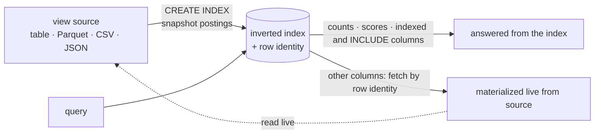

import SqlLogicTest from "@site/src/components/SqlLogicTest";
import DocCallout from "@site/src/components/DocCallout";

An [inverted index](./index.md) can be built over a **view**, not just a base table. This is how SereneDB searches data it does not own a primary copy of — most importantly [external files](./external-data.md) (Parquet, CSV, JSON on disk or S3) exposed through a view.

A view has no primary key of its own, so two things have to be resolved: a **row identity** (so each indexed document can be located again) and, when a query needs a column the index does not hold, a way to **fetch that column on demand**. SereneDB handles both through a *fast-path source*.


```mermaid
flowchart LR
    src["view source<br/>table · Parquet · CSV · JSON"] -->|"CREATE INDEX<br/>snapshot postings"| idx[("inverted index<br/>+ row identity")]
    q["query"] --> idx
    idx -->|"counts · scores · indexed and INCLUDE columns"| fast["answered from the index"]
    idx -->|"other columns: fetch by row identity"| mat["materialized live from source"]
    mat -.->|read live| src
```

Counts, relevance scores and any indexed or `INCLUDE`d column come straight from the frozen index; any *other* column is fetched live from the source by row identity at query time. That split — frozen postings, live values — is the whole model.

<DocCallout type="tip">

A view-backed index stores a **frozen snapshot of the postings** taken at `CREATE INDEX` time — it does not track later changes to the source. Column *values*, however, are read **live** from the source when a query materializes them (see [Materializing real columns](#materializing-real-columns)).

</DocCallout>

All examples below use this setup — a base table and a view over it:

<SqlLogicTest id="sql/indexes/inverted/views/setup" />

## Row identity

How the index derives a stable per-row identity depends on the view body:

| View body | Row identity | Can be overridden |
|---|---|---|
| `SELECT … FROM base_table` (has `PRIMARY KEY`) | The base table's primary key | — |
| `SELECT … FROM base_table` (no PK) | The hidden row id | — |
| `SELECT … FROM read_parquet('file')` | The reader's `file_row_number` | — |
| `read_csv` / `read_json` single file | The byte offset within the file | — |
| Reader over a **glob** (`'…/*.parquet'`) | `(file_index, position)` pair | — |
| Attached DuckDB / Iceberg table | The source row id / `(file_index, row)` | — |
| Attached **PostgreSQL** table | The remote `ctid` | `WITH (key_columns = '…')` |
| Attached **ClickHouse** table | The engine's primary-key columns | `WITH (key_columns = '…')` |
| Generic body (inline `VALUES`, `UNION ALL`, joins) | A synthetic row id | — |

Row identity is always derived automatically — there is no `pk` index option. The only sources that accept an explicit key are [attached external databases](./external-data.md#external-databases), via `key_columns`.

## Fast-path sources

A **fast-path source** is a view body SereneDB recognizes well enough to both derive the row identity and re-read columns by it later. The recognized sources are: SereneDB base tables, `read_parquet` / `read_csv` / `read_json` (and their `*_auto` / `parquet_scan` / `read_ndjson` variants), `read_text`, Iceberg tables, attached DuckDB tables and [attached PostgreSQL and ClickHouse tables](./external-data.md#external-databases).

The view body may shape the source and still qualify as fast-path:

- a column subset, reordering or renaming (`SELECT body, id FROM …`, `SELECT a AS x FROM …`);
- a cast on a column (`SELECT id::BIGINT, body FROM …`);
- a `WHERE` / `ORDER BY` / `LIMIT` in the view body (the index then captures only the rows the view emits).

An indexed **expression** over source columns (`upper(body)`, `(json ->> 'b')`) goes in the index definition, over a plain view.

A body with **no fast-path leaf** — inline `VALUES`, a `UNION ALL`, a join — is a *generic* view: it indexes normally but supports only the non-materializing queries below.

### Keeping a view on the fast path

Besides losing [materialization](#materializing-real-columns), a generic view's index is rebuilt in full on every [refresh](#refreshing-the-index) — each `REINDEX` and each `reindex_interval` tick, whether or not the source changed — even over files or Iceberg, which otherwise refresh incrementally. These make a view generic:

| In the view body | Write instead |
|---|---|
| An expression in the select list: `SELECT id, upper(body) AS body FROM …` | A plain view, with the expression in the index: `USING inverted((upper(body)) en)` |
| A qualified column: `SELECT t.id, t.body FROM … AS t` | Bare column names: `SELECT id, body FROM …` |
| A join, a subquery, `UNION ALL` or inline `VALUES` | One table or one reader call per view |
| `GROUP BY`, `HAVING`, `DISTINCT`, `QUALIFY`, `SAMPLE` or a `WITH` clause | A plain view; aggregate or deduplicate in the query |
| A reader over a list of files: `read_parquet(['a.parquet', 'b.parquet'])` | One glob: `read_parquet('data/*.parquet')` |
| Compressed JSON: a `.gz` / `.zst` path, or `compression = 'gzip'` / `'zstd'` | Uncompressed files, or [`INCLUDE`](#include-columns) the columns you return |

Two constructs keep the fast path but turn every refresh that finds a change into a full rebuild: a `LIMIT` in the view body, and a reader's `union_by_name` option.

### Referencing the source

Names in a view body are resolved each time the view is used — first in the view's own schema, then along the `search_path` of the session running the query. Write a table that lives outside the view's schema in full: a short name makes the view resolve differently, or not at all, depending on who queries it.

<DocCallout type="attention">

**Write an Iceberg table by its full path, `server.namespace.table`.** Any part you leave out has to be looked up in the catalog: SereneDB asks for the table in each Iceberg namespace the name could live in until it finds it — one catalog request for the namespace that holds it, plus a wasted one for every namespace tried before it. These lookups happen when each query is planned, even a query answered entirely from the index, whenever the catalog's cached answer is older than `max_table_staleness` (so on every query if it is not set). With the full path the location is already known, and a query answered from the index makes no catalog request at all.

</DocCallout>

- **Iceberg** — attach the REST catalog with [`CREATE SERVER … FOREIGN DATA WRAPPER iceberg_fdw`](../../statements/create_server/index.md) and use the full path:

  ```sql
  CREATE SERVER lake FOREIGN DATA WRAPPER iceberg_fdw OPTIONS (
      warehouse '⟨warehouse⟩',
      endpoint '⟨https://your-rest-catalog/iceberg/v1/restcatalog⟩',
      authorization_type '⟨oauth2⟩', token '⟨...⟩',
      max_table_staleness '10 minutes');

  CREATE VIEW events_v AS SELECT id, body FROM lake.analytics.events;
  ```

  Prefer the catalog to `iceberg_scan('⟨path⟩')`. A metadata-file path pins the view to that one snapshot, so a refresh never sees newer commits; a table-directory path needs a `version-hint.text` file, which catalog-managed tables usually do not have. The catalog always knows the current snapshot, and every refresh loads it.
- **Parquet, CSV, JSON and text files** — give one path, and use a glob for a dataset that grows: a refresh then re-reads only the files that appeared, changed or disappeared.
- **Attached DuckDB** — attach a database *file*: a table in an in-memory attached database is not a fast-path source.
- **Attached PostgreSQL and ClickHouse** — matches are re-fetched by key; see [the default key](./external-data.md#the-default-key) and when to [override it](./external-data.md#overriding-the-key-with-key_columns).

## What runs without materialization

These queries are answered **entirely from the index**, never touching the source — so they work on every view shape, including generic views:

- `COUNT(*)` / `COUNT(1)`, with or without a `@@` filter;
- full-text [`@@` filters](./full-text-search.md) and secondary scalar filters (`=`, `<`, `BETWEEN`, `IN`) that get pushed into the index scan;
- relevance scores — [`BM25`](./ranking.md), `TFIDF` — and the index `tableoid`;
- [`ts_offsets`](./full-text-search.md#highlighting);
- projections of **indexed** columns and of [`INCLUDE`d](#include-columns) columns and aggregates over them.

<SqlLogicTest id="sql/indexes/inverted/views/count_no_materialization" />

<SqlLogicTest id="sql/indexes/inverted/views/score_no_materialization" />

## Materializing real columns

Selecting a real source column that is neither indexed nor `INCLUDE`d **materializes** it: the index hands back the row identities for the matches, and SereneDB re-reads those columns from the source through the fast-path lookup. The column values are **not stored in the index** — they are fetched live at query time:

<SqlLogicTest id="sql/indexes/inverted/views/materialize" />

Because the read is live, if the underlying source changed after the index was built, materialized values reflect the *current* source: rows deleted from the source come back as `NULL`, and edited content shows its new value (or raises an error if a file became unreadable). Counts and scores, by contrast, still reflect the frozen build-time snapshot.

## Generic views

A generic view (no fast-path source) still indexes and answers the non-materializing queries — no extra options are needed, the postings key on a synthetic row id:

<SqlLogicTest id="sql/indexes/inverted/views/generic_pk" />

Selecting its real columns is not supported and raises an error:

<SqlLogicTest id="sql/indexes/inverted/views/generic_error" />

## `INCLUDE` columns

`INCLUDE`d columns on a view are stored in the index's columnstore, so they are returned **without** materializing the source — the same as on a base table. Use `INCLUDE` for columns you frequently return but never search, to avoid the per-row source lookup. A query that returns only indexed and `INCLUDE`d columns never touches the source at all: over a catalog-attached Iceberg table [named in full](#referencing-the-source) it does not even contact the catalog, so its latency does not depend on the server's `max_table_staleness`.

## Refreshing the index

The postings are a snapshot; the source moves on. `REINDEX INDEX <name>` runs **one refresh pass**: it compares the current source state against what the index holds, applies the difference **incrementally** when the source supports it and falls back to a **full rebuild** when it does not, then publishes the result atomically — readers see either the previous complete state or the new one, never a partial index. (`REINDEX INDEX CONCURRENTLY` is accepted too: the pass never blocks readers either way.)

A pass always compares against the source's **current committed state** — for a catalog-attached Iceberg table it forces a fresh table load even inside the server's `max_table_staleness` window. That is what makes `REINDEX` a freshness barrier: when it returns, everything committed before it is searchable. It requires the `MAINTAIN` privilege on the view (the same class as `VACUUM`).

A pass reads the source in a transaction of its own, not the caller's. Inside an explicit transaction it still sees every commit made before it started, and it never sees the caller's own uncommitted writes to the source. The index itself must be committed: an index created in the same, still-open transaction cannot be refreshed yet.

Only one pass runs per index at a time. A `REINDEX` that finds another pass running — manual or [automatic](#automatic-refresh) — waits for it to finish and then runs its own pass against the source as it is at that moment. While it waits, `pg_stat_progress_create_index` shows it with `command = 'REINDEX'` and phase `waiting for running reindex`; it can be cancelled during the wait. If the source changes while a pass is running, the pass is repeated automatically.

<SqlLogicTest id="sql/indexes/inverted/views/reindex_setup" />

Add a file behind the view's glob and refresh:

<SqlLogicTest id="sql/indexes/inverted/views/reindex_manual" />

This is the building block of a full pipeline: rows land in a table any engine writes to, one `REINDEX` between load and query makes them searchable. The [Search over Iceberg cookbook](../../../cookbook/search/iceberg-insert-to-searchable.md) builds it from zero — catalog, index, freshness barrier, hybrid queries.

What a pass detects — and how much work it does — depends on the source:

| Source | What a pass detects | Work done |
| --- | --- | --- |
| **Iceberg table** | the diff between the indexed snapshot and the table's current one, including row-level deletes | **delta** — only the difference is indexed |
| **File glob** (Parquet/CSV/JSON, local or S3) | files that appeared, changed or disappeared | **delta** — unchanged files are not re-read |
| **Everything else** (base tables, attached databases, generic views) | any change | **full rebuild** each pass |

Two caveats:

- If an Iceberg table's indexed snapshot has left the table's history (rollback, snapshot expiration), the pass falls back to a full rebuild — no sequence comparison can see deletes that were undone.
- An index that cannot re-derive row identity takes the rebuild road regardless of source: one built `WITH (store_pk = 'none')`, or over a view whose body caps rows with `LIMIT`.

### Automatic refresh

The `reindex_interval` index option (milliseconds, `0` = off, the default) runs the same pass periodically, as the owner of the indexed view. It is shorthand for a [job](../../statements/create_job/index.md): a non-zero value creates a job named after the index with an `AFTER <interval>` schedule, so a pass starts that long after the previous one finished. Set it at `CREATE INDEX` or retune it live with `ALTER INDEX` — setting it back to `0` (or `RESET`) drops the job:

<SqlLogicTest id="sql/indexes/inverted/views/reindex_interval" />

The job appears in `duckdb_jobs()` with its run counters and last error, and the usual job statements apply to it: `ALTER JOB ... SUSPEND` pauses the refresh without touching the index option, and `EXECUTE JOB` runs one pass right away. The job targets the index by its internal id, so renaming the index keeps it working, and it is dropped together with the index. Creating the index fails if a job with the same name already exists in the schema.

The job is persisted with the index, so the refresh survives server restarts. A failed pass (source unreachable, empty glob) leaves the index serving its last published state and is recorded as the job's last error; the next pass retries. The pass runs in its own session and reads **global** settings — apply options the source needs with `SET GLOBAL`; a manual `REINDEX` uses the calling session's settings.

## Snapshot and isolation

Between refreshes a view-backed index is a **static snapshot**: its postings are captured at `CREATE INDEX` (or the last refresh) and do not track source changes live — there is no background DML tracking as there is for base tables. A reader transaction keeps a consistent view of the index even if the underlying view is dropped concurrently.

## Row-level security

A query on the index applies the [row-level security policies of the view](../../../security/row_level_security.md#policies-on-views), just like a query on the view itself. A policy may reference any column of the view: columns the index does not store are read from the view, as for any other query on the index.

## See also

- [Indexing External Data](./external-data.md) — Parquet/CSV/JSON on disk or S3, and attached PostgreSQL/ClickHouse
- [Inverted Index](./index.md) — creating an index · [Full-Text Search](./full-text-search.md)
- [CREATE INDEX … USING inverted](../../statements/create_index/inverted.md)
